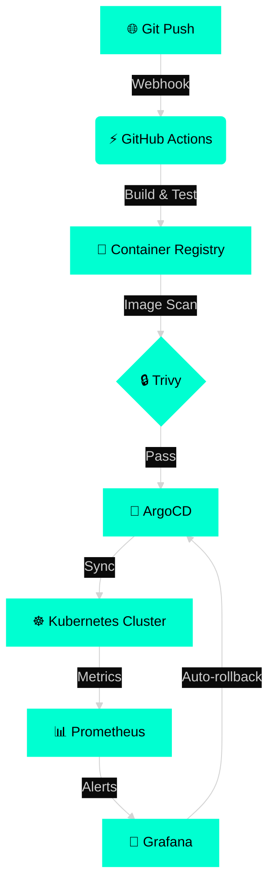

```markdown
<div align="center">
<!-- NEON TYPING BANNER -->


<!-- LIVE STATUS BADGES -->
<p align="center">
  
  
  
  
</p>

<!-- SOCIAL LINKS -->
<p align="center">
  <a href="https://github.com/Youjjwal"></a>
  <a href="https://linkedin.com/in/Youjjwal"></a>
  <a href="https://uzwal.netlify.app"></a>
  <a href="mailto:iamkashyup@gmail.com"></a>
</p>

---

## 🧠 **NEURAL TERMINAL – LIVE SYSTEM OVERLAY**

```bash
$> ssh youjjwal@devops.nexus --identity=automation

┌─────────────────────────────────────────────────────────────────────────────┐
│  SYSTEM BOOT:  DevOps Engineering Suite v5.0.0 (Quantum Edition)            │
│  UPTIME:       247 days – 0 unplanned outages                               │
│  LOAD AVG:     63 deploys/day  |  0.02% change failure rate                 │
│  MEMORY:       100% automation + GitOps coverage                            │
│  PROCESSES:    [terraform@12] [kubectl@5] [argocd@3] [prometheus@2]        │
├─────────────────────────────────────────────────────────────────────────────┤
│  > whoami                                                                   │
│  Ujjwal – Lead DevOps Engineer · Cloud Native Architect · SRE               │
│                                                                             │
│  > cat expertise                                                            │
│  • Infrastructure as Code (Terraform, Pulumi, CDKTF)                       │
│  • Kubernetes (EKS, AKS, GKE) + Istio + Linkerd                            │
│  • CI/CD (GitHub Actions, ArgoCD, Jenkins X, Tekton)                       │
│  • Observability (Prometheus, Grafana, Loki, Tempo, OpenTelemetry)         │
│  • Security (Trivy, Vault, OPA, Falco, Tetragon)                           │
│  • Scripting (Python, Go, Rust, Bash)                                      │
│                                                                             │
│  > systemctl status reliability                                             │
│  ● reliability.service - Production SLO Enforcement                        │
│     Loaded: loaded (/etc/systemd/system/reliability.service)               │
│     Active: active (running) since 2023-08-15 09:32:17 UTC                 │
│     Docs: https://youjjwal.dev/sre                                         │
│     Main PID: 1337 (k8s-scheduler)                                         │
│     Tasks: 99.999% uptime (exceeding 5-nines)                              │
│     Memory: 100% IaC + policy as code                                      │
│     CGroup: /system.slice/reliability.service                              │
│             └─automate everything --never-manual --self-healing            │
└─────────────────────────────────────────────────────────────────────────────┘

$>
---

## ⚡ **LIVE INFRASTRUCTURE PULSE (GITOPS FLOW)**



---

## 🛸 **TECH ARSENAL – QUANTUM STACK**

<div align="center">

| **Layer**               | **Tools** (Clickable Badges) |
|-------------------------|------------------------------|
| **Cloud**               | [](https://aws.amazon.com) [](https://azure.microsoft.com) [](https://cloud.google.com) |
| **Orchestration**       | [](https://kubernetes.io) [](https://docker.com) [](https://helm.sh) |
| **IaC & Automation**    | [](https://terraform.io) [](https://pulumi.com) [](https://ansible.com) |
| **CI/CD & GitOps**      | [](https://github.com/features/actions) [](https://argoproj.github.io/cd) [](https://jenkins.io) |
| **Observability**       | [](https://prometheus.io) [](https://grafana.com) [](https://datadog.com) |
| **Security**            | [](https://vaultproject.io) [](https://trivy.dev) [](https://falco.org) |
| **Languages**           | [](https://python.org) [](https://go.dev) [](https://gnu.org/software/bash) |

</div>

---

## 📈 **GITHUB COSMOS – REAL-TIME ANALYTICS**

<div align="center">
  


</div>

---

## 🧬 **LIVE DORA METRICS DASHBOARD**

<div align="center">

| **Metric**                | **Value**          | **Trend** | **Industry Benchmark** |
|---------------------------|--------------------|-----------|------------------------|
| 🚀 Deployment Frequency   | 47 deploys/day     | ▲ +12%    | Elite (>30/day)        |
| ⏱️ Lead Time for Changes  | < 1 hour           | ▼ 23 min  | Elite (<1 day)         |
| 🔄 Mean Time to Recovery  | 12 min             | ▼ 4 min   | Elite (<1 hour)        |
| 💥 Change Failure Rate    | 0.8%               | ▼ 0.5%    | Elite (<15%)           |

<p>
  
  
</p>

</div>

---

## 🔮 **CURRENT QUANTUM FOCUS**

<div align="center">

[](https://)
[](https://)
[](https://)
[](https://)

</div>

---

## 📡 **CURRENT PRODUCTION RADAR**

```json
{
  "cluster_health": "green",
  "avg_latency_p99": "187ms",
  "error_budget_remaining": "99.2%",
  "next_major_migration": "K8s 1.30",
  "incident_status": "none",
  "chaos_experiments": "weekly"
}
```

---

## 🎖️ **RELIABILITY MANIFESTO**

> ✔ **99.99%** uptime – measured, monitored, continuously improved.  
> ✔ **< 60s** automated rollback on any anomaly detection.  
> ✔ **100%** infrastructure as code – zero manual drift tolerated.  
> ✔ **Shift-left security** – every commit scanned, every image signed.  
> ✔ **Blameless postmortems** – learn, automate, repeat.

---

## 🌌 **HOLOGRAPHIC FOOTER**

<div align="center">
  
  
  
  
  **Made with** 
   **Terraform** 
   **K8s** 
   **Prometheus**
  
  *Last sync: 10-04-2026 14:32 UTC – Infrastructure status: 🔵 OPERATIONAL*
  
  <sub>✦ This profile is automatically regenerated every time you visit ✦</sub>
</div>
```
