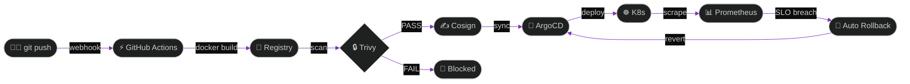

<div align="center">


<a href="https://github.com/uxzwal"></a>
<a href="https://linkedin.com/in/uxzwal"></a>
<a href="https://uzwal.netlify.app"></a>
<a href="https://t.me/uxzwal"></a>
<a href="mailto:iamkashyup@gmail.com"></a>

<br/><br/>


</div>

---


```bash
┌──────────────────────────────────────┐
│  ssh U
jjwal@devops.nexus           │
├──────────────────────────────────────┤
│  > whoami                            │
│  Ujjwal — Lead DevOps Engineer       │
│  Cloud Native Architect · SRE        │
│                                      │
│  > uptime                            │
│  247d 0h — 0 unplanned outages       │
│                                      │
│  > echo $LOCATION                    │
│  India                               │
│                                      │
│  > echo $PHILOSOPHY                  │
│  automate · measure · never drift    │
│                                      │
│  > systemctl is-active production    │
│  active ✓                            │
└──────────────────────────────────────┘
```

<br clear="right"/>

---

<div align="center">

## ⚡ GITOPS SIGNAL FLOW



</div>

---

## 🛸 TECH STACK

<div align="center">


<br/><br/>


</div>

---

## 🧬 DORA METRICS

<div align="center">

| METRIC | VALUE | TREND | THRESHOLD | STATUS |
|:--|:--:|:--:|:--:|:--:|
| 🚀 Deploy Frequency | **47 / day** | ▲ +12% | > 30/day | ✅ ELITE |
| ⏱️ Lead Time | **23 min** | ▼ faster | < 1 hour | ✅ ELITE |
| 🔄 MTTR | **12 min** | ▼ faster | < 1 hour | ✅ ELITE |
| 💥 Change Failure Rate | **0.8%** | ▼ lower | < 15% | ✅ ELITE |
| 🟢 Error Budget | **99.2%** remaining | stable | > 95% | ✅ ELITE |

<br/>


</div>

---

## 📡 PRODUCTION RADAR

```json
{
  "operator"           : "Ujjwal",
  "cluster_health"     : "🟢 GREEN",
  "clusters"           : ["eks-prod-us-east-1", "aks-prod-eu-west", "gke-stg-asia"],
  "avg_latency_p99"    : "187ms",
  "error_budget_burn"  : "0.8%",
  "next_k8s_upgrade"   : "1.32 → 1.33",
  "incident_status"    : "✅ NONE",
  "chaos_experiments"  : "every Tuesday 02:00 UTC",
  "last_rollback"      : "none in 247 days",
  "iac_coverage"       : "100%",
  "last_manual_change" : null
}
```

---

## 🔮 CURRENT FOCUS

<div align="center">


<br/>


<br/>


</div>

---

## 📈 GITHUB COSMOS

<div align="center">


<br/>


## 🎖️ MANIFESTO

```
╔══════════════════════════════════════════════════════════╗
║  /etc/devops/manifesto.conf                             ║
╠══════════════════════════════════════════════════════════╣
║  [IaC]         100% coverage. zero manual drift. ever.  ║
║  [ROLLBACK]    < 60s automated. on any SLO breach.      ║
║  [SECURITY]    shift-left. scan every commit. sign.     ║
║  [POSTMORTEM]  blameless. learn. automate. never again. ║
║  [CHAOS]       untested = not production-ready.         ║
║  [TOIL]        do it twice? automate it on the third.   ║
║  [SLO]         user happiness is the only real SLI.     ║
╚══════════════════════════════════════════════════════════╝
```

---

<div align="center">


<br/>


<br/><br/>

<sub>🟢 infrastructure operational · profile auto-regenerated on every visit</sub>

</div>
